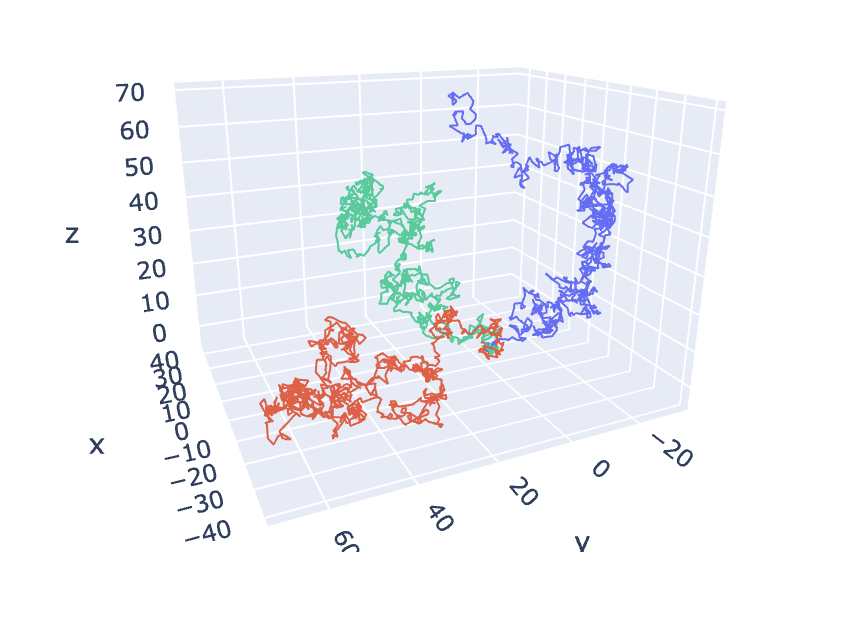
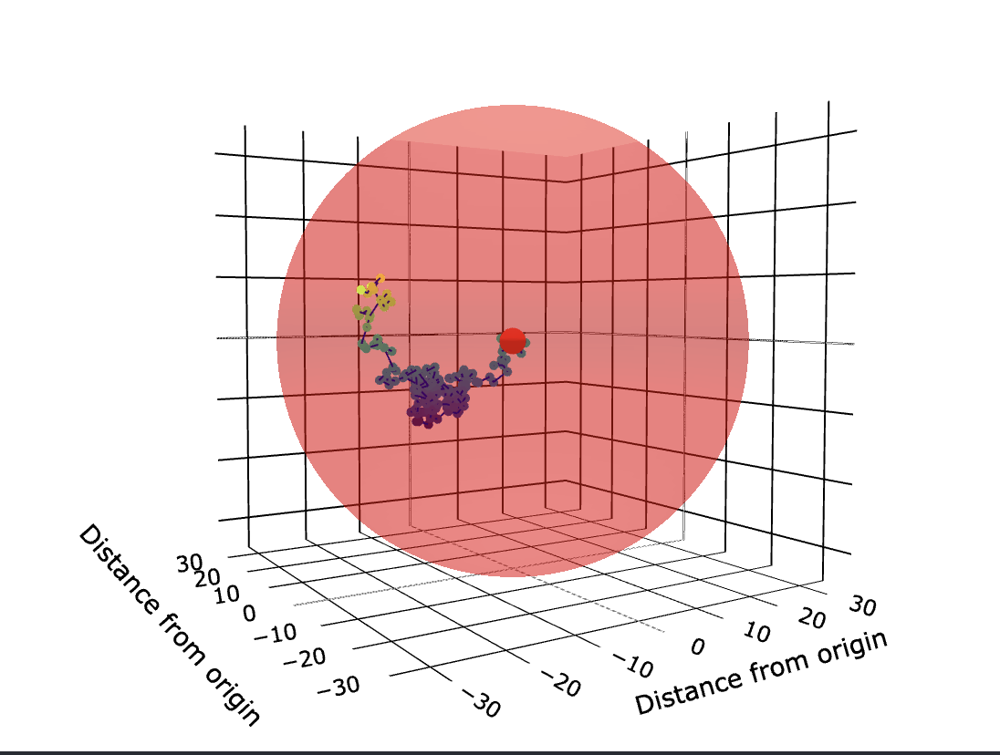
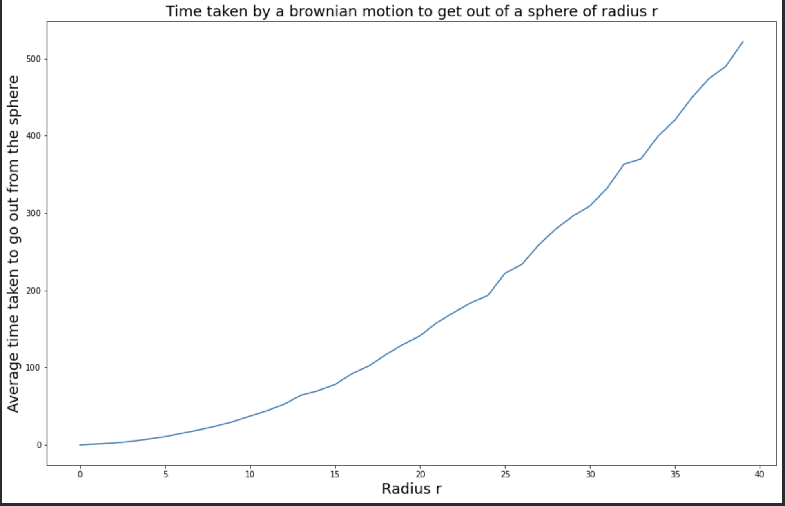

# 🤖 Brownian Motion

Just playing with Brownian Motion for fun and visualizing it crossing a sphere.

# 🎇 Demo

### Several Paths of Brownian Motion

### Brownian Motion crossing a sphere

### Average time a Brownian Motion takes to cross a sphere

# 🙋🏻‍♂️ Authors

- [@Francois Porcher](https://github.com/FrancoisPorcher)

## 🔗 Links

